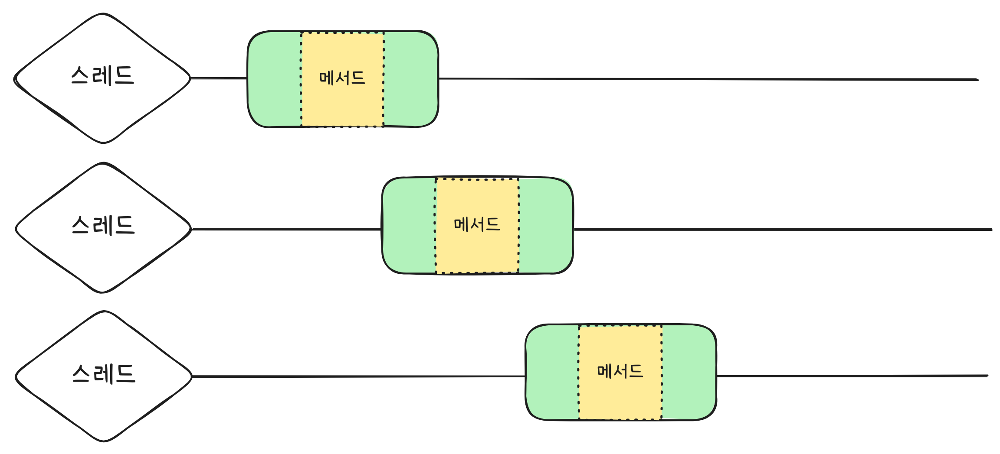

# Distributed Lock Toy Project
기존 프로젝트("DongHaeng", "행복하개")의 분산 락을 개선하기 위한 토이프로젝트입니다.

## 1.  배경
***
핀테크 프로젝트를 하면서 이체 기능의 백엔드를 담당했던 경험이 있습니다.  
다중화된 API 서버가 하나의 데이터베이스를 바라보고 있어, 동일한 계좌에 대해 동시에 이체 요청이 발생하면 동시성 문제가 발생했습니다.

이러한 문제를 처리하기 위해 위해 기존에는 **AOP 기반 Redis 분산 락**을 적용했으나 다음과 같은 단점이 존재했습니다:

- 락이 **불필요한 로직까지 감싸면서 성능 저하** 발생
- 수만 건의 동시 요청에서 간헐적인 락 실패

이러한 문제들을 개선하고 학습하고자 이 프로젝트를 진행하게 되었습니다. 
프로젝트 컨셉은 상점에 인기있는 상품에 대해 많은 사람들이 주문을 하는 상황을 가정하여 설계했습니다.

## 2. AOP 분산 락 동작 방식
***
AOP 분산 락은 다음의 흐름으로 구현했습니다:

1. `@RedisLock` 어노테이션을 메서드에 선언하면,
2. `RedisLockAop` 클래스가 AOP로 해당 메서드를 감지
3. `AopLockManager`를 통해 Redis에 락 키를 설정
   - 실패 시 재시도 -> 스핀락
     - waitTime동안 반복
   - 스핀락으로 구현한 이유는 테스트 시 총량에 대한 처리 속도를 측정하기 위해 스핀락으로 구현했습니다.
4. 락 획득 후, `AopTransaction`에서 트랜잭션으로 감싸 비즈니스 로직 실행
5. 비즈니스 로직 후 락 해제

## 3. 개선 방법
***
자바의 `sychronized`처럼 락이 필요한 로직과 불필요한 로직을 구분하여 락을 사용할 수 있게끔 함수형으로 새로 구현했습니다.

## 4. 함수형 분산 락 동작 방식
***

함수형 분산 락은 다음과 같이 동작합니다:

1. `tryLock(key, () -> { ... })` 형식으로 비즈니스 로직을 `FucntionalLockManager`에 전달
2. `FucntionalLockManager`를 통해 Redis에 락 키를 설정
3. 락 획득 시 `SupplierTransaction`에서 트랜잭션 실행
4. 비즈니스 로직 후 락 해제

~~~java
functionalLockManager.tryLock(key, () -> {
			// 비즈니스 로직
		});
~~~

## 5. 성능 비교
***

테스트 코드를 작성함과 동시에 Spring Stopwatch를 활용하여 일차적으로 각 방식에 대한 성능을 테스트해보았습니다.

추가적으로 락이 필요한 로직과 불필요한 로직을 좀 더 극대화하여 나타내기 위해 각 메서드에 `Thread.sleep(50)`으로
인위적으로 스레드를 일시 정지시켰습니다.

~~~java
public void orderAopLock(Long productId, OrderRequest request) throws InterruptedException {
	Thread.sleep(50);
	// ...
}

public void orderFunctionalLock(Long productId, OrderRequest request) throws InterruptedException {
    Thread.sleep(50);
	// ...
}
~~~

### AOP 분산락 
~~~java
@Test
	void 동시에_100개의_주문_AOPLock() throws InterruptedException {
		int threadCount = 100;
		ExecutorService executorService = Executors.newFixedThreadPool(threadCount);
		CountDownLatch latch = new CountDownLatch(threadCount);

		StopWatch stopWatch = new StopWatch();
		stopWatch.start();

		for (int i = 0; i < threadCount; i++) {
			executorService.submit(() -> {
				try {
					OrderRequest request = new OrderRequest(buyerId, 1);
					orderService.orderAopLock(productId, request);
				} catch (Exception e) {
					log.error("AOP 주문 실패: {}", e.getMessage());
				} finally {
					latch.countDown();
				}
			});
		}

		latch.await();

		stopWatch.stop();

		ProductQuantity productQuantity = productQuantityRepository.findByProductId(productId)
				.orElseThrow();

		log.info("AOP 최종 재고: {}", productQuantity.getQuantity());
		log.info("AOPLock 처리 시간: {} ms", stopWatch.getTotalTimeMillis());

		assertThat(productQuantity.getQuantity()).isEqualTo(0);
	}
~~~

위 코드는 AOP 분산락 테스트 코드입니다. 100건의 요청이 동시에 들어왔을 때 물건의 재고가 잘 감소하는지 확인합니다.

결과는 다음과 같습니다.

### 함수형 분산 락
~~~java
@Test
	void 동시에_100개의_주문_FunctionalLock() throws InterruptedException {

		int threadCount = 100;
		ExecutorService executorService = Executors.newFixedThreadPool(threadCount);
		CountDownLatch latch = new CountDownLatch(threadCount);

		StopWatch stopWatch = new StopWatch();
		stopWatch.start();

		for (int i = 0; i < threadCount; i++) {
			executorService.submit(() -> {
				try {
					OrderRequest request = new OrderRequest(buyerId, 1);
					orderService.orderFunctionalLock(productId, request);
				} catch (Exception e) {
					log.error("Functional 주문 실패: {}", e.getMessage());
				} finally {
					latch.countDown();
				}
			});
		}

		latch.await();

		stopWatch.stop();

		ProductQuantity productQuantity = productQuantityRepository.findByProductId(productId)
				.orElseThrow();

		log.info("Functional 최종 재고: {}", productQuantity.getQuantity());
		log.info("FunctionalLock 처리 시간: {} ms", stopWatch.getTotalTimeMillis());

		assertThat(productQuantity.getQuantity()).isEqualTo(0);
	}
~~~

함수형 분산 락도 위의 테스트 코드를 통해 같은 비즈니스 로직으로 테스트해보았습니다.

### 결과
두 분산 락 모두 동시성을 잘 제어하는 것을 확인할 수 있습니다. 하지만, 함수형:4023ms AOP:9159ms도 큰 차이를
나타내었습니다. 좀 더 자세한 테스트를 해보기 위해 K6를 활용하여 각 api에 대해 만건의 요청을 동시에 보내고 성능을
측정해보았습니다.

- 시나리오: 100명의 동시 사용자가 각 api에 대해 100번 요청

#### AOP

- 최대 5분 중 5분 소요
- http_req_failed: 30.07% (1850 / 6152)
  - 완료된 6152건 중 1850건 성공
- http_req_duration
  - avg: 4.92s
  - max: 10.18s
    - waitTime이 끝나 작업 실패

#### Functional

- 최대 5분 중 47.5초 소요
- http_req_failed: 0%
  - 전부 성공
- http_req_duration
  - avg: 420.69ms
  - max: 7.17s

## 정리
***

K6 테스트 결과에서 확인할 수 있듯이 AOP 분산 락은 처리량을 따라가지 못해 30% 정도의 요청이 실패하는 것을 확인할 수 있습니다.
반면, 함수형에서는 모든 건을 성공적으로 처리하였습니다. 평균 응답 시간도 4.92s 대 420.92ms로 약 11.7배나 차이나는
것을 확인하였습니다.

이 차이는 접근하려는 자원이 점유중일때 어떤 일을 하느냐에서 생깁니다. 락이 필요한 메서드가 있다고 가정해봅시다.
전체 소요 시간은 6초인데 락이 필요한 시간은 2초라고 가정합니다.

AOP 분산 락의 경우 메서드 전체를 락으로 잡기 때문에 락이 걸려 있으면 다른 스레드는 대기하고 있을 수 밖에 없습니다.

그래서 위와 같이 순차적으로 실행되는 형태로 18초라는 시간이 걸리게 됩니다.

함수형 분산 락에서는 위 초록색인 구간, 즉 락이 필요없는 구간을 다른 스레드가 락을 점유하고 있으면 그 사이에 처리할 수 있습니다.

그래서 위와 같이 총 10초라는 시간이 걸리게 됩니다.

이러한 이유로 함수형 분산 락이 AOP 분산 락보다 높은 성능을 가집니다(단, 메서드 전체가 락이 필요한 메서드가 아닐 시).

## 6. 추가적인 고려사항
***

### Lettuce 선정 이유
